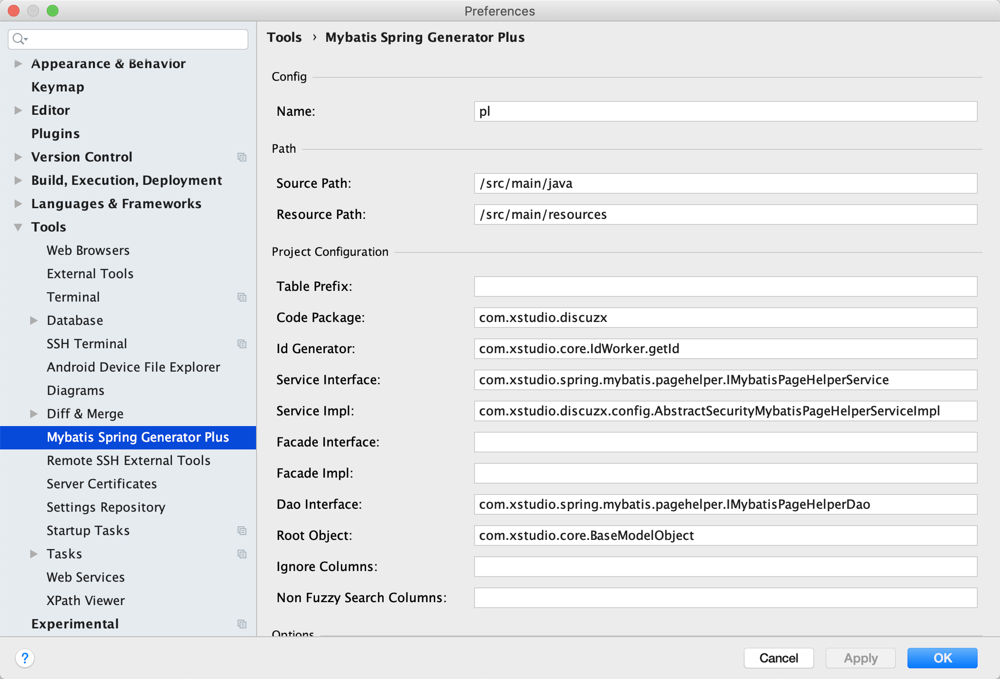
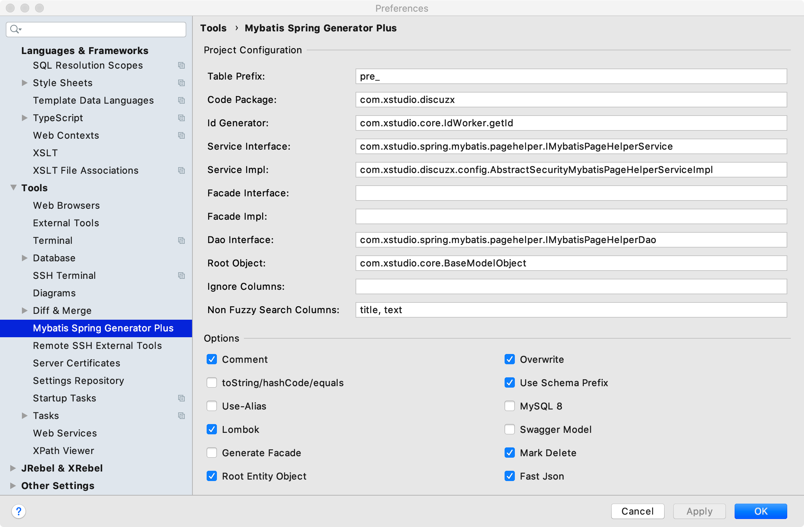
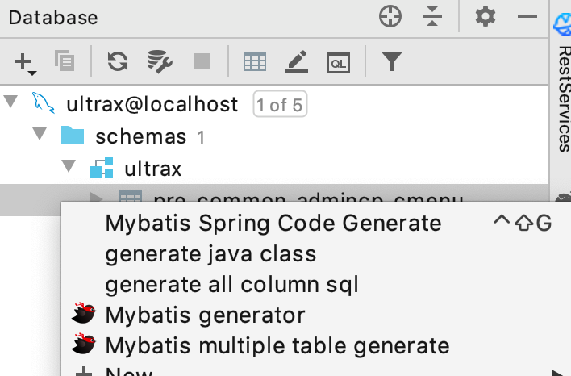

## idea mybatis 代码生成器 

### 简介
spring + mybatis的基础代码生成器，生成`service`和`dao`层  

该生成器结合[xstudio项目](https://github.com/xbeeant/xstudio)的[mybatis-pagehelper](https://github.com/xbeeant/xstudio/tree/master/mybatis-pagehelper/src/main/java/com/xstudio/spring/mybatis/pagehelper)下的`IMybatisPageHelperService` ,`IMybatisPageHelperDao` ,`AbstractMybatisPageHelperServiceImpl`使用，也可自行继承实现[core](https://github.com/xbeeant/xstudio/blob/master/core/src/main/java/com/xstudio/core/)下的`IAbstractDao`,`AbstractServiceImpl`,`IAbstractService`使用或结合

要求数据库各表都需要有 `create_at`字段，默认使用此字段进行排序, 如果没有，请自行实现修改源码[xstudio项目](https://github.com/xbeeant/xstudio)，建议提供：`update_at`,`create_by`,`update_by` 

交流群：
QQ:977611117  

#### IAbstractDao 支持方法

| 方法名 | 说明 |
| ---- | --- |
| countByExample | 按条件[只支持 `and` `=` ]统计, 例如： select count(*) from table where column1 = 1 and column2 = 2|
| insertSelective | 按赋值写入 对`null` `''`不会写入 |
| batchInsertSelective | `insertSelective`的批量操作，`mysql`数据库需要`allowMultiQueries=true` |
| deleteByPrimaryKey | 按主键删除 |
| batchDeleteByPrimaryKey | 按主键批量删除 |
| updateByPrimaryKeySelective | 按主键更新，对`null`的字段不会更新  |
| updateByExampleSelective | 按条件更新[只支持 `and` `=` ]，对`null`的字段不会更新 |
| batchUpdateByPrimaryKeySelective | `updateByExampleSelective`的批量操作 |
| selectByPrimaryKey | 按主键查询, 例如： `select * from table where key = ?`  |
| selectByExample | 分页的按条件查询,不含`text`等类型大字段[只支持 `and` `=` ], 例如： `select * from table where column1 = 1 and column2 = 2` |
| selectByExampleWithBLOBs | 分页的同`selectByExample`，但包含`text`等类型大字段 |
| fuzzySearch | 字符串类型的模糊搜索, 例如 `select * from table where column1 like '%a%' `|
| fuzzySearchByPager | 分页模糊搜索 |

#### IAbstractService 支持方法 
对`IAbstractDao`方法的服务包装，提供

| 方法名 | 说明 |
| ---- | --- |
| countByExample | 按条件统计 |
| insertSelective | 按赋值写入 对`null` `''`不会写入 |
| batchInsertSelective | 批量写入 |
| deleteByPrimaryKey | 按主键删除 |
| batchDeleteByPrimaryKey | 按主键批量删除 |
| updateByPrimaryKeySelective | 按主键更新，对`null`的字段不会更新  |
| updateByExampleSelective | 匹配条件的更新 |
| batchUpdateByPrimaryKeySelective | 批量操作 |
| selectByPrimaryKey | 按主键查询 |
| selectOneByExample | 选择一条数据，不含`text`等类型大字段，多条数据时返回`success: false` |
| selectOneByExampleWithBlobs | 选择一条数据,含`text`等类型大字段 |
| selectByExampleByPager | 分页的按条件查询,不含`text`等类型大字段 |
| selectByExampleWithBlobsByPager | 分页的同`selectByExampleByPager`，但包含`text`等类型大字段 |
| selectAllByExample | 查询所有，包含`text`等类型大字段 |
| uniqueValid | 字段唯一性校验 |
| fuzzySearch | 字符串类型的模糊搜索 |
| fuzzySearchByPager | 分页模糊搜索 |

 ### 全局配置

### 使用

